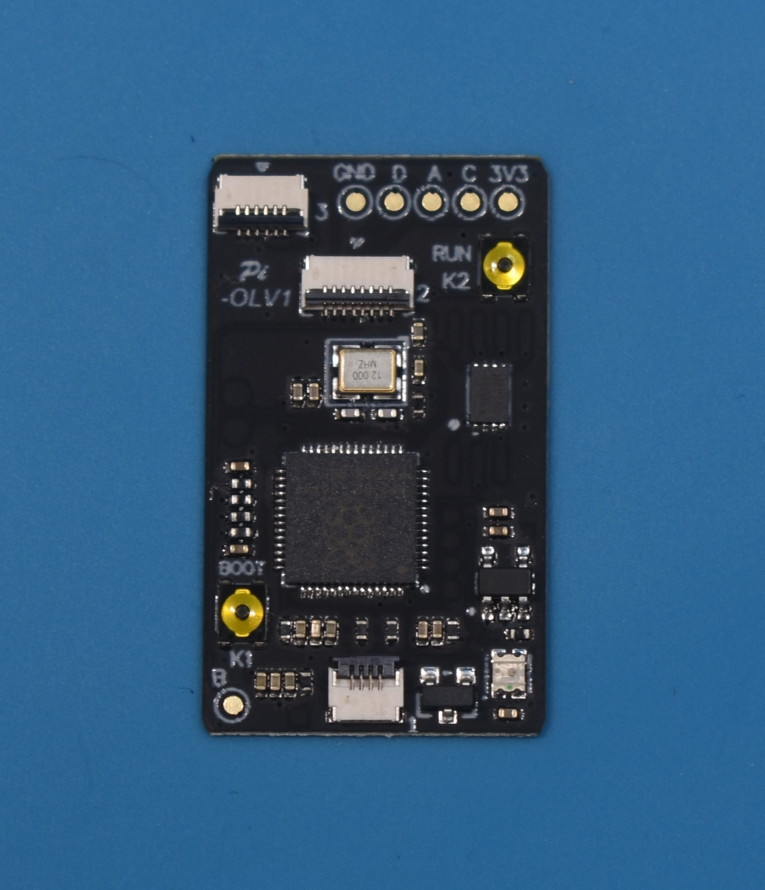
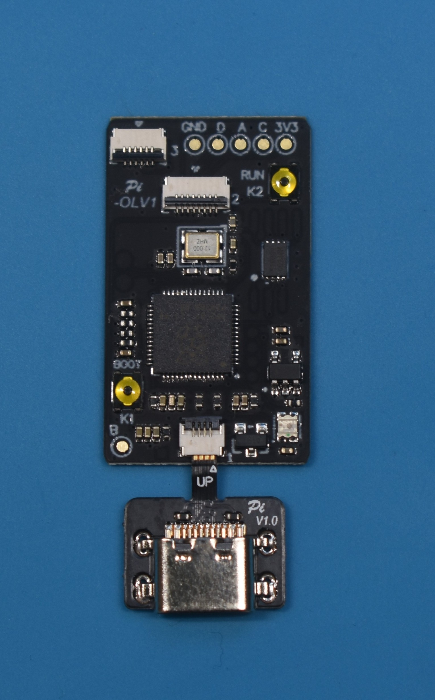
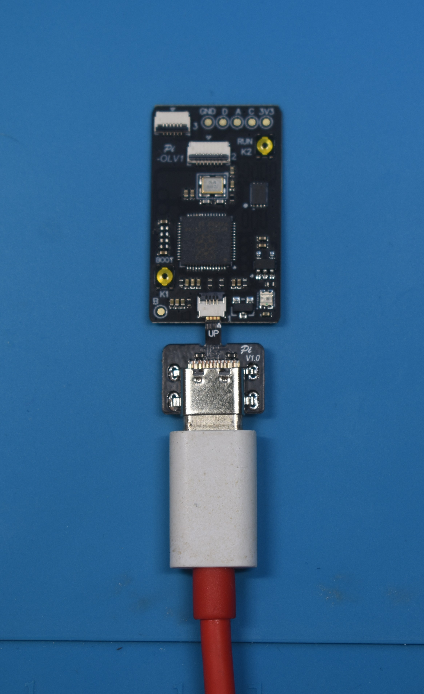

#### Introduction

Modchips have their own separate firmware version that is separate from the Switch's system firmware version, this firmware ultimately determines the functionality and performance of your modchip.
Flashing the firmware to the modchip is not a requirement but it is recommended to do so, generally speaking.

Any Picofly firmware below version `2.70` is deprecated and is no longer supported, this is why we will be ensuring that the modchip has the latest firmware version, namely `2.75`, flashed to it. This will make sure that you have the best performance and hardware compatibility.

This process is the same for all Picofly modchip models, just use the pictures in the instructions below as reference for your own modchip as the Normal and Lite Picofly models look physically different from the OLED model.

!!! note ""

    **If you're looking to flash your modchip's firmware while it's installed in your Switch console already, see [this page](../extras/alternate_flashing.md).**

-----

#### What you need:

- The micro USB / USB-C debug port that comes with a modchip "set" (image shown in the "Instructions" section below)
- Your Picofly modchip / A stock `RP2040 Zero` development board
- A computer or Android phone (computer recommended)
- A USB type C to USB type A cable / A micro USB to USB type A cable capable of data transfer
     - The type of cable required depends on the modchip revision you have.
       More recently produced Picofly modchips will come with USB type C debug ports.
       The stock `RP2040 Zero` development board has a USB-C port soldered onto it and will need to be desoldered later.

#### Instructions:

1. Download the `.uf2`file from the link below:
    - [Firmware 2.75](firmware/firmware.uf2)

2. Position your modchip and included USB debug port in the upwards facing position. This means with the side of the RP2040 microcontroller (the square chip with the Raspberry Pi logo) facing you. This is important    because if you don't do this, you can risk frying the USB circuitry of the modchip. The USB debug port additionally also has `UP` text written on it to indicate the orientation of it.  
{ width="600" }

    - This step can be ignored for the stock `RP2040 Zero` development board users as they can be flashed directly via the soldered on USB-C port.

3. Lift up the locking tab and plug the USB debug port into the connector at the bottom of your modchip, then lock the locking tab to secure the USB debug port in place.  
{ width="600" }
    - This step can also be ignored for the stock `RP2040 Zero` development board users as they do not have this port and do not require a separate USB debug port.

4. Hold the `BOOT` button on the modchip and plug the USB debug port into your PC via your data transfer-capable USB cable.  
{ width="600" }

5. Your PC should play the "Device connected" sound and a drive should show up on your PC, you should be able to access and open it.  

6. Drag the `.uf2` file into the root of the drive and wait for the file transfer to finish. The drive will eject itself after it's done.  

7. Your modchip is now flashed with the latest firmware version, proceed with the modchip installation for your model of Switch console by pressing the relevant button below.

??? note "About flashing Hwfly/SX series modchips"

    Instructions on how to flash Hwfly/SX series differ a tiny amount from Picofly modchips, they don't have the `BOOT` button and only require you to plug them into your PC to flash them.

    #### Instructions:

    1. Download the `.zip` file from the link below and extract the `.zip` file to a location on your PC:
         - [Firmware 0.7.2](firmware/release_072.zip)

    2. Position your modchip and included USB debug port in the upwards facing position. This means with the side of the microcontroller (the biggest square chip) facing you. This is important because if you don't do this, you can risk frying the USB circuitry of the modchip. The USB debug port additionally also has `UP` text written on it to indicate the orientation.  
    { width="600" }

    3. Lift up the locking tab and plug the USB debug port into the connector at the bottom of your modchip, then lock the locking tab to secure the USB debug port in place.  
    { width="600" }

    4. Plug the USB debug port into your PC via your data transfer-capable USB cable.
       your PC should play the "Device connected" sound, which indicates that it's plugged in correctly.  
    { width="600" }

    5. Open the extracted folder from earlier and run `flash.bat`.

    6. Wait for the script to finish, it will tell you when it's done and prompt you to press a key to exit the flashing script.

    7. Your modchip is now flashed with the latest firmware version.

[Continue to Modchip installation Switch :material-arrow-right:](normal.md){ .md-button .md-button--primary }

[Continue to Modchip installation Switch Lite :material-arrow-right:](lite.md){ .md-button .md-button--primary }

[Continue to Modchip installation Switch OLED :material-arrow-right:](oled.md){ .md-button .md-button--primary }
