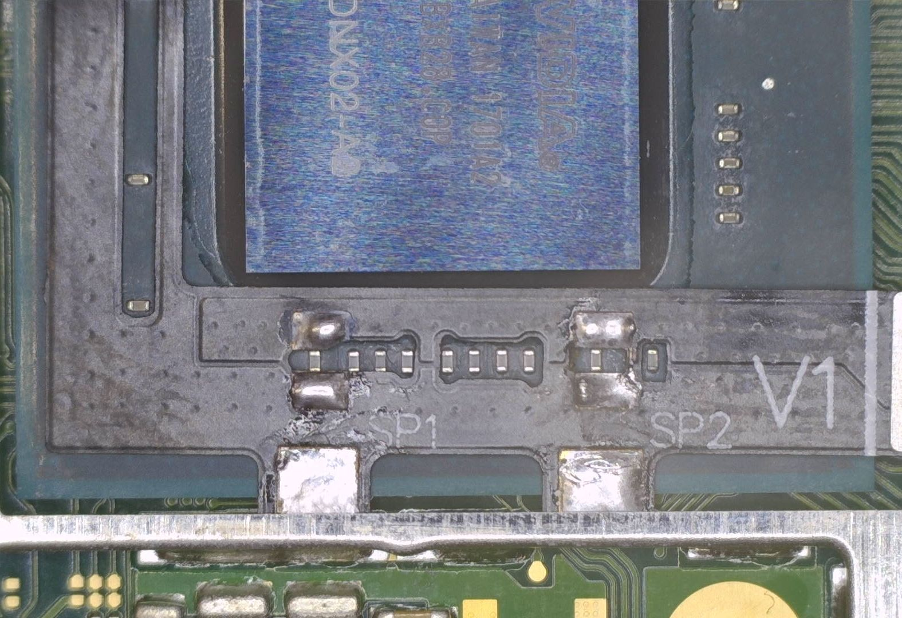
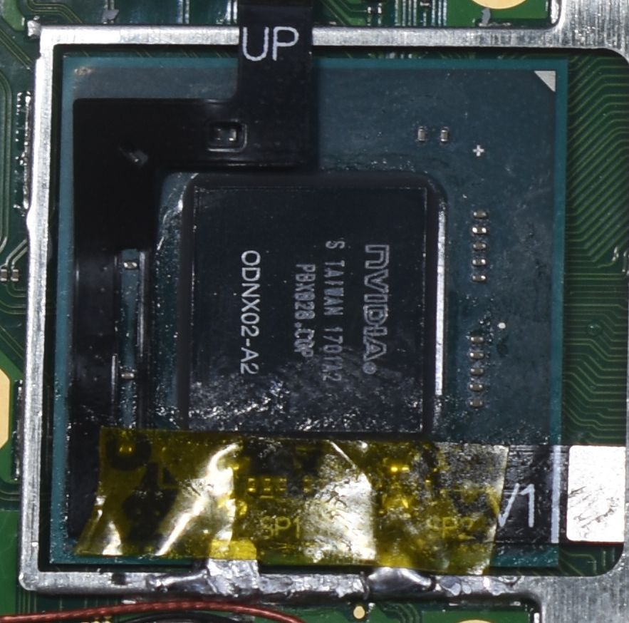
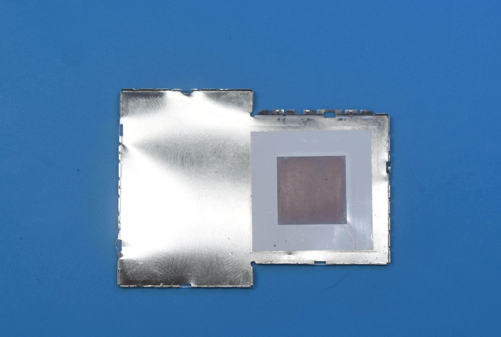

---
hide:
  - navigation
  - toc
---

### **The Installation**

This page will guide you through the modchip installation process on "Normal" model Switch consoles. Everything you need will be listed and pictures of what your solder joints should look like will be posted by each step.
Specific steps such as photos of the screws you need to unscrew aren't mentioned here as they can be found on guides from iFixit (for example). It's expected for you to know what to unscrew.

#### Diode reading values

These values can differ from console to console. If your modchip installation works fine and doesn't match these exact values, it's not an issue. These values can act as "indicators" about what you might expect.

| Positive to ground     | Negative to ground     |
| ---------------------- | ---------------------- |
| **SP1**  `~0.125`      | **SP1**  `~0.125`      |
| **SP2**  `~0.12`       | **SP2**  `~0.10`       |

#### Requirements:

- A soldering iron with a small(er) tip (preferably temperature controlled that can reach 350C consistently)
- Good quality flux
- The right screwdriver bits (+00 and Y1.5 bits)
- Thermal paste (preferably non-conductive)
- Isopropyl Alcohol (preferably 95-99% IPA)
- Your modchip (including the SoC ribbon cable)
- Kapton tape (optional, but recommended)
- Toothpicks/Q-tips (to remove the thermal paste between the capacitors on the SoC)
- Soldering tin (leaded is recommended, unleaded will work depending on your skill level)
- A fume extractor (for your own health and safety)
- A microscope (optional but recommended)

??? note "Note for stock RP2040 Zero development board users"
     If you use a stock `RP2040 Zero` development board, you will need to desolder the USB-C port,`BOOT` and `RESET` buttons before continuing. You'll also need to purchase the SoC ribbon cable separately together with 5x `0805 47Ω +-1%` resistors (5x is recommended, 3x is possible in some instances).
     The resistors can be purchased on AliExpress or websites like Digikey or Mouser Electronics. The SoC ribbon cable can be purchased from AliExpress.

#### Instructions:

1. Unscrew and remove the Switch's backplate. Ensure you remove both middle screws on either side of the console, the screw at the top of the console, the two screws at the bottom of the console and the screw underneath the kickstand.
     
     

2. Remove the SD card reader.
     
     

3. Remove the metal shield/cover and disconnect the battery in the bottom right of the motherboard.
     

4. Remove the heatpipe/heatsink.
     

5. Remove the IHS (Internal Heat Spreader) to expose the bare SoC die and RAM chips.
     

6. Remove and clean up the thermal paste on the SoC die and around/in-between the capacitors on the SoC using IPA.
       - You can also clean off the thermal paste between the IHS and heatpipe/heatsink in the meantime, the red-ish colored thermal goop between the heatpipe/heatsink and metal shield/cover can be left alone.

     

7. Remove (unplug) the eMMC module from the motherboard.
     

8. Ensure your working area is clean, you do *not* want to have thermal paste interfere with your soldering tin. This can also cause corrosion over time if you don't clean the area properly.

9. Apply flux and pre-tin the pads labeled `SP1` and `SP2` on the SoC ribbon cable. (This process is the same for V2 SoC consoles and ribbon cables, the only difference are the orientation of the capacitors and the pads that are connected to each side of the capacitors on the SoC.)
     
     

10. Place the SoC ribbon cable and align the ribbon cable with the capacitors on the SoC.

11. Tuck the anker points underneath the metal frame below the SoC and the MOSFET section of the ribbon cable underneath the frame between the SoC and RAM, then solder the ribbon cable down once lined up correctly.
     

12. Apply flux and use your soldering iron to heat up the end of each capacitor together with the respective pad next to both ends of each capacitor of the `SP1` and `SP2` points, ensure the solder flows between the pad on the ribbon cable and end of the capacitor.
     

13. Your ribbon cable should now be secured in place with both ends of each capacitor soldered to the pads on the ribbon cable.
       - Optional: Place Kapton tape across your solder joints to prevent thermal paste from potentially corroding your solder joints in the future. It also helps in cases where you might have to rework your solder joints.
       

14. Install the modchip. Slide the SoC ribbon cable into the connector on the left side of the modchip, install the left side of the modchip onto the eMMC module's FPC connector, install the eMMC module on the modchip, place a non-conductive material (like Kapton tape) between the eMMC module and the RAM chips, reconnect the battery and turn the console on. The modchip should blink blue a couple of times (glitching), then white (success). You should end up at a "No SD Card" splash screen with the Picofly logo after the modchip blinks white once.
     
     

15. Modify the IHS so that the SoC ribbon cable can stick out at the top. Bend the folded over side at the top of the SoC section flat with the end of tweezers or another strong flat material.
     

16. Reassemble the console (don't forget to apply thermal paste!) until you're at the point of putting the metal shield/backplate back in place. The modchip will not fit underneath the metal shield/backplate so you will need to cut a strip out of it, how I personally do this is by using regular scissors and cutting out the middle section.
     

17. Once done, you can fully reassemble the console and your console should now display "No SD Card" when you turn it on normally.
     
     
     

#### What's next?

From here, if you get the same result as I did, you can continue following the NH Server guide to set up CFW by clicking the button below. If you want to know more about the functionality of modchips, visit the "**Functionality of modchips**" page [here](../functionality/functionality_of_modchips.md).

[Continue to the NH Server guide :material-arrow-right:](https://nh-server.github.io/switch-guide/){ .md-button .md-button--primary }

!!! danger ""
    If you didn't get the same result as I did and are running into issues, please follow the troubleshooting section of this guide.
    It can be found [here](../troubleshooting/error_codes.md).
